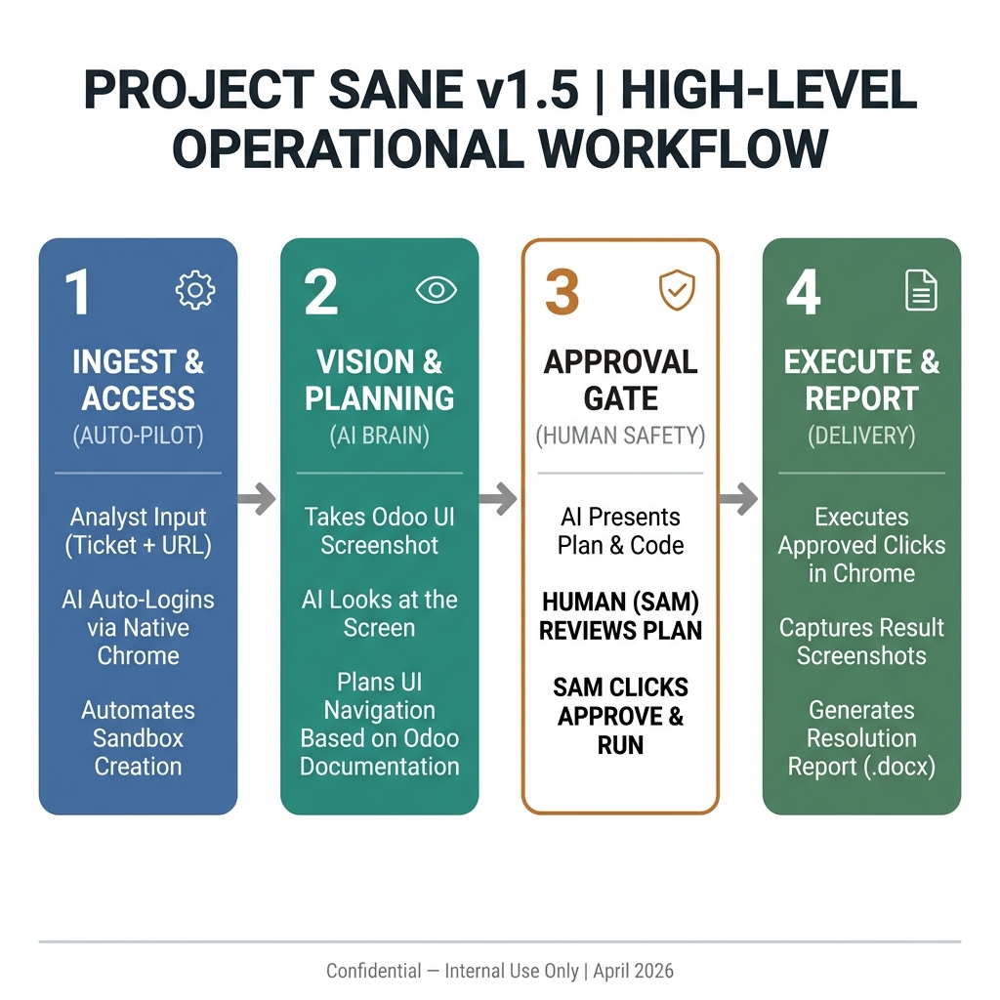

# Project Sane — CTO Engineering Review
# Version 1.5 | Date: April 2026

---



---

## Executive Summary

Project Sane is an internal browser automation and AI orchestration system that reduces the time required to investigate and resolve Odoo customer support tickets. The analyst pastes a ticket into a local web interface. The system autonomously reads the ticket, opens the customer's duplicate database in a managed Chrome session, navigates the Odoo UI, captures visual evidence, queries real-time official documentation via Gemini with Google Search grounding, and produces a structured Word report with a resolution guide.

This document covers the full technical architecture, the browser session design decisions, the AI routing strategy, all known issues resolved during development, and the current state of the system as of version 1.5.

---

## 1. System Goals

The system was built to accomplish three things:

1. Eliminate the manual work of opening a customer database, navigating to the affected area, and checking installed modules and configuration — tasks that are identical across every ticket.
2. Surface the relevant section of official Odoo documentation automatically, grounded in the actual ticket content and Odoo version.
3. Generate a fully formatted investigation report that the analyst can deliver to the customer without additional formatting work.

---

## 2. Architecture

### 2.1 Component Overview

The system has five Python modules, one HTML frontend, and two external API dependencies.

```
browser_agent.py      Chrome automation via Playwright CDP
ai_agent.py           Groq + Gemini API routing and prompt management
server.py             FastAPI application, job lifecycle, SSE streaming
doc_writer.py         Word report generation
templates/index.html  Analyst web interface
```

### 2.2 Request Lifecycle

When the analyst submits a ticket, the following sequence executes:

**Step 1 — Ticket Extraction**

The raw ticket text is sent to Groq (llama-3.3-70b-versatile) with a structured extraction prompt. The response is a JSON object containing the issue summary, Odoo version, affected module, error message text, reproduction steps, a boolean indicating whether Runbot verification is needed, and a list of configuration keys to inspect.

Groq is used at this stage rather than Gemini because its free tier has a much higher request quota and its latency for structured JSON extraction is lower. This step typically completes in under two seconds.

**Step 2 — Browser Session Initialisation**

The browser agent checks whether a Chrome process is already listening on CDP port 9225. If not, it copies the analyst's Odoo session cookies from their Chrome Profile 3 directory into a separate working profile (`ChromeAgentWork`), then launches Chrome via subprocess with `--remote-debugging-port=9225`. Playwright connects to this running process via `connect_over_cdp`.

The global browser singleton pattern means that from the second ticket run onwards, Chrome is already running and the agent simply opens a new tab rather than relaunching.

**Step 3 — Odoo Navigation**

Inside the browser tab, the agent:

- Navigates to `<database_url>/_odoo/support`
- Automatically handles the support login page by filling the reason field with `testing` and clicking submit
- Checks the support gateway page for existing duplicate databases, identified by `support-` appearing in the link href
- If a duplicate exists, navigates to it; if not, clicks the Duplicate button and polls until the new duplicate appears
- Handles the duplicate database's own support login if required
- Clicks through to enter the duplicate database
- Navigates to Apps and Modules and captures screenshots at each stage

**Step 4 — AI Investigation**

A full-page screenshot is captured and base64-encoded. Gemini 2.5 Pro receives this screenshot alongside the ticket context and the system prompt. The model uses Google Search grounding to query official Odoo documentation in real time for the detected version and module.

The model produces a two-part output. First, a Functional Blueprint in Markdown format: a Request Summary, a Diagnosis and Cause section, and a step-by-step Solution Path. Second, a Playwright Python script that implements the Solution Path as browser automation code operating on `self.page`.

**Step 4b — Human-in-the-Loop Approval**

The generated script is streamed to the frontend as an SSE event of type `approval_required`. The server pauses and waits up to five minutes for the analyst to click Approve or Skip. This gate is mandatory and was established as a non-negotiable engineering requirement in the project's lessons document. AI-generated code that can modify a live Odoo database must have explicit human authorisation before execution.

**Step 5 — Report Generation**

`python-docx` assembles a Word document from all collected data: ticket metadata, original ticket text, investigation findings, inline screenshots, and the Gemini resolution guide. The file is saved to the `output/` directory and made available for download.

---

## 3. AI Model Routing Strategy

The system uses what was internally designated Option C — a hybrid routing strategy that assigns different AI models to different tasks based on the requirements of each task.

| Task | Model | Provider | Reason |
|---|---|---|---|
| Ticket extraction | llama-3.3-70b-versatile | Groq | Free tier, high quota, consistent JSON |
| Documentation search and blueprint | gemini-2.5-pro | Google Gemini | Google Search grounding, multimodal |
| Playwright script generation | gemini-2.5-pro | Google Gemini | Code generation quality |
| Resolution synthesis | gemini-2.5-pro | Google Gemini | Long-context reasoning |

The system also supports a local provider mode. Setting `ACTIVE_PROVIDER=local` routes all AI calls to an LM Studio endpoint at `LOCAL_API_BASE`. Screenshots are sent as multimodal input if the local model supports them. This mode was validated against Gemma 3 Vision running locally and produces functional output for simpler tickets.

---

## 4. Browser Session Architecture

This section documents the sequence of design decisions made to arrive at the current stable browser session implementation. Each decision was made in response to a specific failure mode.

### 4.1 Initial Approach: Playwright launch_persistent_context

The first implementation used Playwright's `launch_persistent_context` with the `ChromeProjectSane` profile directory. This method is Playwright's standard approach for persistent sessions.

**Failure mode:** `BrowserType.launch_persistent_context: Protocol error (Browser.getWindowForTarget): Browser window not found`

**Root cause:** Playwright's launcher injects `--use-mock-keychain` into every Chrome launch command. On macOS, this flag tells Chrome to use a fake, empty keychain instead of the system keychain. The `ChromeProjectSane` profile contains real Google OAuth tokens encrypted against the system keychain. Chrome attempts to decrypt them, fails, and exits with exit code 0. Playwright holds a reference to the now-dead process and throws `Browser window not found` when it tries to call `Browser.getWindowForTarget`.

This was confirmed by comparing the Chrome process arguments when launched via Playwright against when launched directly via subprocess. The `--use-mock-keychain` flag was absent in the subprocess launch and the process remained alive.

### 4.2 Attempted Workaround: connect_over_cdp

The second approach launched Chrome manually via subprocess with `--remote-debugging-port=9222` using the original profile and then used Playwright's `connect_over_cdp` to attach.

**Failure mode:** `BrowserType.connect_over_cdp: Protocol error (Browser.setDownloadBehavior): Browser context management is not supported`

**Root cause:** Playwright's `connect_over_cdp` sends `Browser.setDownloadBehavior` as part of its connection setup sequence. The Chrome instance on port 9222 was the Antigravity IDE browser, not the user's Odoo-authenticated Chrome. That browser rejected the command.

### 4.3 Resolution: Subprocess Launch with Cookie Sync

The final and current implementation:

1. The agent maintains a separate Chrome working directory (`ChromeAgentWork`). This is required because Chrome's security policy refuses `--remote-debugging-port` when `--user-data-dir` points to the default Chrome directory.
2. Before each first launch, the agent copies the `Cookies` SQLite database from `Chrome/Profile 3` (the analyst's authenticated Odoo profile) into `ChromeAgentWork/Default/Cookies`.
3. Chrome is launched via `subprocess.Popen` without any Playwright involvement. The launch command includes `--remote-debugging-port=9225` and points to `ChromeAgentWork`.
4. Playwright starts a separate instance of its own process via `async_playwright().start()` and calls `connect_over_cdp("http://localhost:9225")` to attach to the already-running Chrome.
5. A new tab is opened via `context.new_page()` and all subsequent navigation happens through this tab.

This approach is stable because Chrome is not subject to Playwright's launcher flags, the session cookie is present in the working profile, and the CDP connection to the subprocess does not attempt context-level operations that Chrome rejects.

### 4.4 Global Singleton

`server.py` maintains a single global `BrowserAgent` instance. On the first ticket run, `start()` launches Chrome and establishes the CDP connection. On subsequent runs, `start()` detects that `self.context is not None` and opens a new tab instead of relaunching. This prevents the profile lock that occurs when Chrome is killed and immediately relaunched.

`stop()` is a deliberate no-op. The browser window remains open after each ticket so the analyst can inspect the state manually.

---

## 5. Odoo Duplicate Database Flow

The support gateway at `/_odoo/support` is the entry point for all customer database investigations. The page displays:

- The name of the current database as a clickable link
- Existing duplicate databases as links (URL pattern: `<name>-support-<date>-<suffix>.odoo.com`)
- A Duplicate button to create a new copy

The agent's navigation logic prioritises existing duplicates over creating new ones. It queries for all anchor elements whose `href` contains `support-`. If any are found, it clicks the first result. If none are found, it clicks the Duplicate button and polls for up to 60 seconds until a `support-` link appears on the page.

After navigating to the duplicate's domain, the agent may encounter a second support login screen. The same automated login procedure is applied: the reason field is filled with `testing` and the submit button is clicked. The agent then clicks through to enter the database proper.

---

## 6. Safety Architecture

### 6.1 exec() Safety Gate

AI-generated Playwright code is piped through Python's `exec()` when approved. `exec()` provides no sandboxing. The executed code runs with the full privileges of the Python process and can modify any data in the Odoo database.

The safety architecture consists of a single human-in-the-loop gate. The generated script is displayed verbatim to the analyst in the web UI before any execution occurs. The analyst must click Approve for execution to proceed. The Skip option allows the pipeline to continue with static findings only.

This requirement is recorded as a mandatory engineering constraint in `lessons.md`. It applies to all future modifications of the system.

### 6.2 API Keys

All API keys are stored in `.env` which is excluded from version control via `.gitignore`. Keys are loaded at server startup via `python-dotenv` and passed explicitly to the AI agent constructor. Keys are never logged.

---

## 7. Issues Resolved During Development

| Issue | Root Cause | Resolution |
|---|---|---|
| `Browser window not found` | Playwright's `--use-mock-keychain` flag broke macOS keychain token decryption, causing Chrome to exit on startup | Replaced Playwright launcher with subprocess.Popen |
| `Browser context management is not supported` | connect_over_cdp was targeting the Antigravity IDE browser, not the Odoo-authenticated profile | Isolated the agent to a dedicated CDP port (9225) with its own Chrome launch |
| `IndexError: list index out of range` | Race condition where Playwright's `context.pages` was accessed before Chrome had registered the initial tab | Replaced `context.pages[0]` access with explicit `context.new_page()` call |
| Wrong Chrome profile launched | Agent was using `ChromeAgentSane`, an empty profile with no Odoo cookies | Identified correct profile as `Chrome/Profile 3` (shsri@odoo.com), implemented cookie sync |
| New Chrome window on every ticket | Profile directory lock caused by previous Chrome window remaining open | Implemented global browser singleton with `is_port_open` check before any launch |
| Blank UI on error | `index.html` had no rendering logic for error states when `activeStep` was 0 | Added explicit error rendering path in the UI step tracker |
| Agent entering production database | Step 3 clicked the first link found on the support page, which was the current (production) database link | Rewrote Step 3 to search specifically for `support-` links before falling back to the Duplicate button |
| Screenshot timeout 30 s | Chrome was showing a system dialog blocking the page paint | Reduced screenshot timeout to 8 s with graceful skip on failure |

---

## 8. Dependencies

```
playwright >= 1.40.0       Browser automation and CDP connection management
python-docx >= 1.1.0       Word report generation
requests >= 2.31.0         HTTP API calls to Groq and Gemini REST endpoints
python-dotenv >= 1.0.0     Environment variable loading
fastapi >= 0.110.0         Web framework and SSE streaming
uvicorn >= 0.27.0          ASGI server
jinja2 >= 3.1.0            HTML template rendering
python-multipart >= 0.0.9  Form data parsing for the /run endpoint
google-genai >= 1.0.0      Gemini SDK with streaming and Google Search grounding support
openai >= 1.0.0            Used as the local LM Studio client when ACTIVE_PROVIDER=local
```

---

## 9. Environment Setup Summary

```bash
# Clone and set up
git clone https://github.com/Sam06002/ProjectSane.git
cd ProjectSane
python3 -m venv .venv
source .venv/bin/activate
pip install -r requirements.txt
playwright install chromium

# Configure
cp .env.example .env
# Add GROQ_API_KEY and GEMINI_API_KEY to .env

# Run
./.venv/bin/uvicorn server:app --port 8000 --reload
# Open http://localhost:8000
```

---

## 10. Outstanding Items

The following items are in progress or planned:

- Runbot integration testing has not been validated end-to-end. The `test_on_runbot` method exists and navigates to runbot.odoo.com but has not been exercised against a live ticket with `check_runbot: true`.
- The cookie sync mechanism copies the cookie file at browser launch time. If the session cookie expires during a long ticket run, subsequent navigation will hit the Odoo login page. A re-sync mechanism triggered by a detected login redirect would address this.
- Gemini 2.5 Pro rate limits on the free tier cause retry delays of up to 70 seconds on consecutive runs. Upgrading to a paid tier would eliminate this.
- The AI script generation currently targets the Apps and Modules page as its starting point rather than the exact area of the Odoo UI relevant to the ticket. Improving the navigation to the correct module before taking the screenshot would increase the relevance of the generated script.
- The report Word document uses plain paragraph text for the resolution guide. Formatting the Gemini Markdown output into proper Word heading and body styles would improve readability.

---

## 11. File Reference

| File | Lines | Description |
|---|---|---|
| `server.py` | 261 | FastAPI app, SSE stream, HITL endpoints, global browser singleton |
| `ai_agent.py` | 395 | All AI logic: Groq extraction, Gemini blueprint, script generation, synthesis |
| `browser_agent.py` | ~420 | Chrome lifecycle, CDP connection, Odoo navigation, duplicate DB, screenshots |
| `doc_writer.py` | 47 | Word report assembly |
| `templates/index.html` | ~600 | Analyst UI with step tracker, HITL code review, download |
| `requirements.txt` | 9 | Python package pins |
| `lessons.md` | 79 | Engineering decisions and safety constraints |
| `.env.example` | 5 | Environment variable template |

---

*Document prepared for CTO review. Project Sane v1.5. April 2026.*
